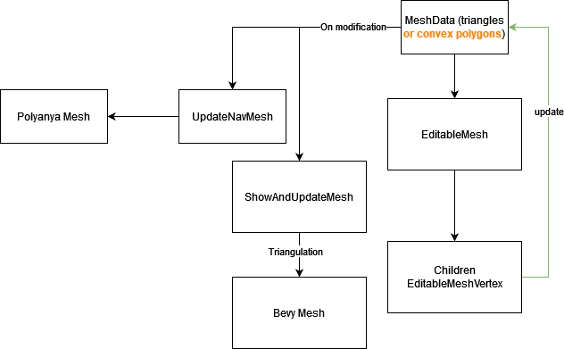

# :construction: Very unstable project.

## Objective

Navmeshes can be hard to setup in [bevy engine](https://github.com/bevyengine/bevy).

Meshquisse is an attempt to fill the gaps:
- creating a nav mesh
  - During development (offline)
  - Or during runtime (online)
- displaying that nav mesh, transforming it into a bevy mesh
- Have some tools to help with that
  - triangulation
  - base mesh creation (grids)
  - show navmesh path with debug lines

## Current status

### Showcase

https://user-images.githubusercontent.com/2290685/194018684-093299ca-8e81-411a-a286-7e03de622f26.mp4

### Roadmap

- [x] polygon navmesh into bevy mesh
- [x] modular design to render a bevy mesh, update in runtime or update a navmesh optionally 
- [x] use convex polygons rather than triangles
- [ ] code clean

## Tech talk

The idea is to have a mesh data, to work with different modules (navmesh, render, interactive edition...).

Following diagram is a rough representation of the components organization of the project.

